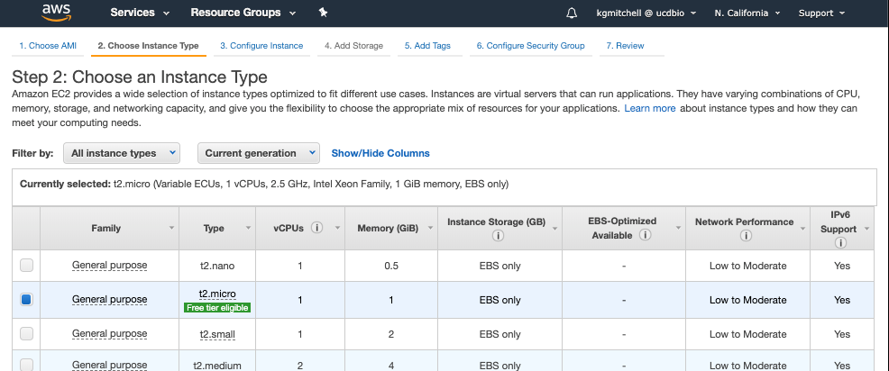

# Starting a Shiny Server Instance from the Preconfigured Image

### Keith Mitchell (kgmitchell@ucdavis.edu)
***
#### A few general notes:
- be sure Adam has granted you an IAM account on the UC Davis Bioinformatics AWS account. 
- Do not nuke the Zulip instances!
***
#### How to prepare the instance for a client:
1. Go to the AWS AMI's (Amazon Machine Images). Select the Rshiny Server Image. Go to Actions>Launch

2. Next Choose and Instance Type. This will vary in general based on the size of the data you are attempting to analyze. 
In general it is advised to start with a smaller instance and then move up from there if necessary.

3. Next Configure the Instance Details. The main step here is to set the "Auto-assign Public IP" to enable.

4. Keep clicking the bottom right button, "Next: Configure Security Group" until you get to "Step 6: Configure Security Group"
5. At step 6, select the Rshiny App security group.

6. Finally launch the instance. (Bottom right hand quarter)

7. Select an existing key pair or create a new key pair is the final step for starting the instance. 
Choose "Create a new key pair" and give the key a useful name, here we will use "tutorial".

8. Move the downloaded key to `~/.ssh/` via `mv ~/Downloads/tutorial.pem ~/.ssh/`
9. `chmod 700 ~/.ssh/tutorial.pem `
10. Get the connection to the instance seen highlighted below "ec2-…….amazonaws.com"

11. Run the following command to upload the "experiment_merged.Rdata" object to the app:
    - `scp -i ~/.ssh/tutorial.pem ec2-54-219-166-77.us-west-1.compute.amazonaws.com:/srv/shiny-server/scRNA_shiny_app/  ~/Desktop/experiment_merged.Rdata`
13. Replace the green section with your Public IV4 DNS address from the instance that was created and used in the previous step.
    - http://**ec2-54-219-166-77.us-west-1.compute.amazonaws.com**:3838/scRNA_shiny_app/
14. If there are problems with this link do the following:
    - SSH into the server.
        - `ssh -i ~/.ssh/tutorial.key ec2-54-219-166-77.us-west-1.compute.amazonaws.com`
    - Restart the shiny service.
        - `sudo systemctl restart shiny-server.service`
        
